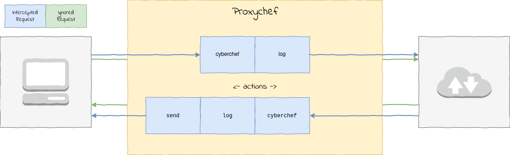

# ProxyChef 

A NodeJS based *man-in-the-middle* proxy, with support for custom intercepts and actions (i.e modification via GCHQ's [Cyberchef](#)).

## Architecture



### Intercepts

An **intercept** is a rule for determining whether they request should undergo additional processing by the proxy. If a request matches an intercept rule, then any **actions** specified in the intercept `.json` file will be executed against it.

### Actions

An **action** is responsible for either logging or manipulating a given message - these are located in `lib/actions/`. They may be applied against either a *request* (i.e outbound to target) or a *response* (i.e inbound to client).

Actions are documented in the applicable `.js` file.

## Configuration

URL Pattern Matching is done via the [url-pattern](https://www.npmjs.com/package/url-pattern) NodeJS module; please refer to it's documentation for a full explanation of it's usage.

### Example One:

This JSON object configures interceptions for any requests to `http://www.mocky.io/v2/*` with the HTTP verbs `GET` and `POST`. The actions specify that any responses should be decoded from Base 64, before encoded to their unicode character code equivalent.

```
{
    "methods": [
        "GET", "POST"
    ],
    "patterns": [
        "http\\://www.mocky.io/v2/:mockId"
    ],
    "inbound": {
        "cyberchef": {
            "steps": [
                {
                    "operation": "toBase64"
                },
                {
                    "operation": "toCharCode"
                }
            ]
        },
        "send": {}
    }
}
```

### Example Two:

The following configuration object configures intercepts for any requests to `http://fergus.london/*` with the HTTP verbs of `GET` and `POST`. Any requests will be *blackholed* - that is to say that they will not their reach their destination.

Initially the request will be logged, then a response will be built with a HTTP status code of `404` and a body of `not found here`, and then this response will be sent to the client.

```
{
    "methods": [
        "GET", "POST"
    ],
    "patterns": [
        "http\\://fergus.london/(:mockId)"
    ],
    "outbound": {
        "blackhole": true,
        "log": {},
        "respond": {
            "code": 404,
            "content": "not found here."
        },
        "send": {}
    }
}
```

## Limitations

At the moment the primary limitation is usability and documentation; notably:

1. I haven't documented the actions at the moment, mainly because they've all been written ad-hoc to scratch various itches;
2. the usability of having everything logged to the CLI is obviously not ideal, whilst logging to a database adds *a lot* of overhead and then requires a UI or way of retrieving it. A likely mitigation here is dumping requests/responses out to JSON files - but this will require a means for pairing requests and responses.


## License

This project is licensed under the terms of the MIT License, please see the `LICENSE` file.